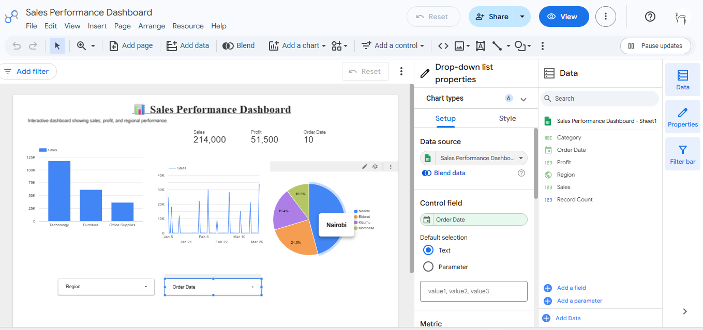

# Sales Performance Dashboard

## Overview
This project is an interactive sales dashboard built using Google Looker Studio and Google Sheets. It provides key business insights through charts, scorecards, and filters, allowing users to explore sales performance across different regions and time periods.

## Features
- Interactive dashboard
- Sales by category
- Sales trends over time
- Regional filtering
- Date filtering
- KPI scorecards

## Tools Used
- Google Looker Studio
- Google Sheets

## Dashboard Preview

## Project Objective
The objective of this project is to demonstrate data visualization skills by transforming raw sales data into meaningful insights that support data-driven decision-making.
## Live Dashboard

Google Looker Studio:
https://datastudio.google.com/reporting/3d6d6e19-3b2d-4cb8-9e22-ebd543b58d7a

## Author

Jeremy Osuo

University of Nairobi
